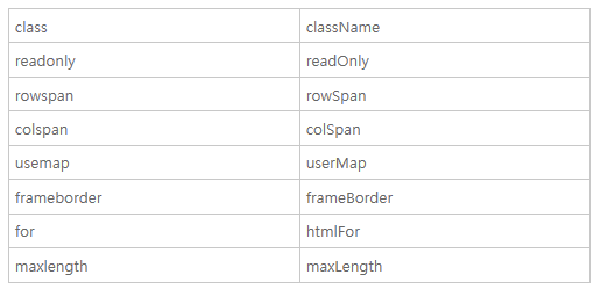

* jQuery 객체
  * jQuery 함수의 리턴값으로 jQuery 함수를 이용해서 선택한 엘리먼트들에 대해서 처리할 작업을 프로퍼티로 가지고 있는 객체다.

  * 암시적 반복
    * jQuery 객체의 가장 중요한 특성은 암시적인 반복을 수행한다는 것이다. DOM과 다르게 jQuery 객체의 메소드를 실행하면 선택된 엘리먼트 전체에 대해서 동시에 작업이 처리된다. 암시적 반복은 값을 설정할 때만 동작한다. 값을 가져올 때는 선택된 엘리먼트 중 첫번째에 대한 값만을 반환한다. 이에 대한 내용은 아래에서 살펴본다.

    * li.css('text-decoration', 'underline'); // setter
      li.css('text-decoration'); // getter

  * 체이닝
    * chainig이란 선택된 엘리먼트에 대해서 연속적으로 작업을 처리할 수 있는 방법이다.
    * li.css('text-decoration', 'underline').('color', ''red);
  
  * jquery API
    * 제어할 대상을 선택한 후에는 대상에 대한 연산을 해야한다.
    * .css와 .attr은 jQuery 객체가 가지고 있는 메소드 중의 하나인데, jQuery는 그 외에도 많은 API를 제공하고 있다.
    * https://api.jquery.com

* Element 객체
  * 소개
    : Element 객체는 엘리먼트를 추상화한 객체다. HTMLElement 객체와의 관계를 이해하기 위해서는 DOM의 취지에 대한 이해가 선행되야 한다. DOM은 HTML만을 제어하기 위한 모델이 아니다. HTML이나 XML, SVG, XUL과 같이 마크업 형태의 언어를 제어하기 위한 규격이기 때문에 Element는 마크업 언어의 일반적인 규격에 대한 속성을 정의하고 있고, 각각의 구체적인 언어(HTML,XML,SVG)를 위한 기능은 HTMLElement, SVGElement, XULElement와 같은 객체를 통해서 추가해서 사용하고 있다.
    * Markup 언어를(e.g 열리고(<html>) 닫히고(</html>) 제어하기 위한 규격은 DOM
  
  * 다른 객치들과의 관계
    * DOM의 계층구조에서 Element 객체의 위치는 아래와 같다.
      

  * 식별자 API
    * 엘리먼트를 제어하기 위해서는 그 엘리먼트를 조회하기 위한 식별자가 필요하다. 본 수업에서는 식별자 API들에 대해서 알아보자.
     HTML에서 엘리먼트의 이름과 id 그리고 class는 식별자로 사용된다. 식별자 API는 이 식별자를 가져오고 변경하는 역할을 한다.
    * Element.tagName
      * 해당 엘리먼트의 태그 이름을 알아낸다. 태그 이름을 변경하지는 못한다.
    * Element.id
      * 문서에서 id는 단 하나만 등장할 수 있는 식별자다. 아래 예제는 id의 값을 읽고 변경하는 방법을 보여준다.
    * Element.className
      * 클래스는 여러개의 엘리먼트를 그룹핑할 때 사용한다. (여러개의 DOM을 동시에 바꾸거나 제어하기 위해 용이함)
    * Element.classList
      * className에 비해서 훨씬 편리한 사용성을 제공한다.

  * 조회 API
    * Element.getElementsBy
    * 조회 API는 엘리먼트를 조회하는 기능이다. 조회 방법에 대해서는 이미 여러차례 살펴봤기 때문에 이번 시간에 알아볼 내용은 조회 대상을 제한하는 방법에 대한 것이다. 지금까지 document.getElementsBy* 메소드를 통해서 엘리먼트를 조회했다. document 객체는 문서 전체를 의미하는 엘리먼트이기 때문에 document의 조회 메소드는 문서 전체를 대상으로 엘리먼트를 조회한다. Element 객체 역시도 getElementsBy* 엘리먼트를 가지고 있는데 Element 객체의 조회 메소드는 해당 엘리먼트의 하위 엘리먼트를 대상으로 조회를 수행한다. 

  * 속성 API
    * Element.*Attribute
    * 속성은 HTML에서 태그명만으로는 부족한 부가적인 정보라고 할 수 있다. 이 속성을 어떻게 제어하는가 알아보자.
      속성을 제어하는 API는 아래와 같다. 각각의 기능은 이름을 통해서 충분히 유추할 수 있을 것이다.
      * Element.getAttribute(name)
        Element.setAttribute(name, value)
        Element.hasAttribute(name);
        Element.removeAttribute(name);

      * href, title이 속성
      ```html
      <a id="target" href="http://opentutorials.org" title="opentutorials.org">opentutorials</a>
      ```
    * attribute vs property (속성과 프로퍼티)
      * 모든 엘리먼트의 (HTML)속성은 (JavaScript 객체의) 속성과 프로퍼티로 제어가 가능하다. 예제를 보자.

      * setAttribute('class', 'important')와 className = 'important'는 같은 결과를 만든다. 하지만 전자는 attribute 방식(속성이라고 부르겠다)이고 후자는 property 방식이다. property 방식은 좀 더 간편하고 속도도 빠르지만 실제 html 속성의 이름과 다른 이름을 갖는 경우가 있다. 그것은 자바스크립트의 이름 규칙 때문이다.
        
      
      * 심지어 속성과 프로퍼티는 값이 다를수도 있다. 아래 코드를 실행한 결과는 속성과 프로퍼티의 값이 꼭 같은 것은 아니라는 것을 보여준다.

  * jQuery 속성 제어 API
    * 속성 제어
      * jQuery 객체의 메소드 중 setAttribute, getAttribute에 대응되는 메소드는 attr이다. 또한 removeAttribute에 대응되는 메소드로는 removeAttr이 있다. 
    * attribute와 property
      * DOM과 마찬가지로 jQuery도 속성(attribute)과 프로퍼티를 구분한다. 속성은 attr, 프로퍼티는 prop 메소드를 사용한다.
      * jQuery를 이용하면 프로퍼티의 이름으로 어떤 것을 사용하건 올바른 것으로 교정해준다. 이런 것이 라이브러리를 사용하는 의의라고 할수 있겠다.

  * jQuery 조회 범위 제한
    * 이전 수업에서 Element 객체에서 getElementsBy* 메소드를 실행하면 조회의 범위가 그 객체의 하위 엘리먼트로 제한된다는 것을 알아봤다. jQuery에서는 어떻게 이러한 작업을 할 수 있을까?

    * selector context
      * 가장 간편한 방법은 조회할 때 조회 범위를 제한하는 것이다. 그 제한된 범위를 jQuery에서는 selector context라고 한다.

    * find()
