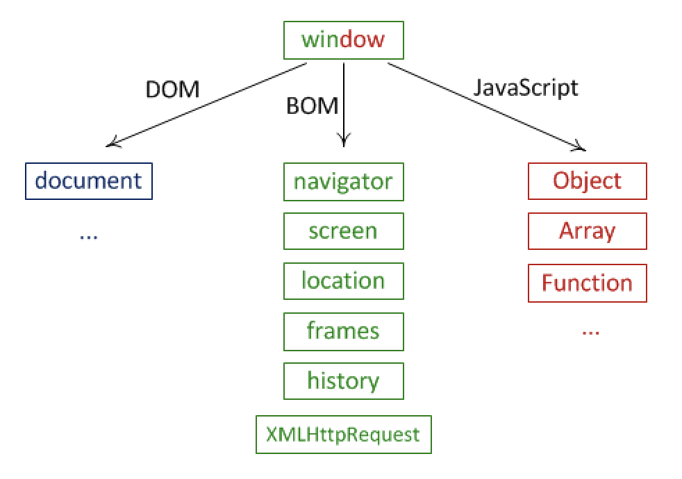

* Object Model
  * 웹브라우저의 구성요소들은 하나하나가 객체화되어 있다. 자바스크립트로 이 객체를 제어해서 웹브라우저를 제어할 수 있게 된다. 이 객체들은 서로 계층적인 관계로 구조화되어 있다. BOM과 DOM은 이 구조를 구성하고 있는 가장 큰 틀의 분류라고 할 수 있다. 이 관계를 그림으로 나타내면 아래와 같다. (출처 : http://learn.javascript.ru/browser-environment)
  

  * Javascript로 웹브라우저를 제어하기 위해 객체를 만드는 것 -> 객체화

  * window 객체 : 전역객체, window, frame  // 브라우저 윈도우 객체
    * DOM : Document Object Model
      * document 객체 : window.document = document  // 브라우저가 갖고있는 미리 준비된 객체
        * body, img 등 tag 제어
    * BOM : Browser Object Model
      * 현재 웹브라우저가 가리키는 url 및 표시하는 페이지 reload 등
    * JSC : Javascript Core
      * Javascript 언어는 아래 호스트 환경을 제어하는 공통적인 언어
        * 브라우저 : DOM, BOM 존재
        * GAS(Google Apps Script) : DOM, BOM 없음 -> 브라우저와 다른 객체 존재
        * node.js : DOM, BOM 없음 -> 브라우저와 다른 객체 존재
      * Javascript 자체적 객체 존재 (호스트 환경 관계없이 모두 가지고 있음)
        * Object, Array, Function, Date
