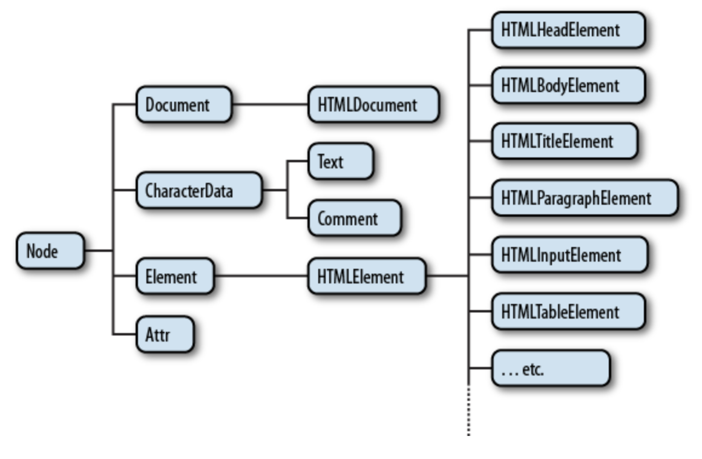

* DOM (Document Object Model)
  * Document Object Model로 웹페이지를 자바스크립트로 제어하기 위한 객체 모델을 의미한다. window 객체의 document 프로퍼티를 통해서 사용할 수 있다. Window 객체가 창을 의미한다면 Document 객체는 윈도우에 로드된 문서를 의미한다고 할 수 있다. DOM의 하위 수업에서는 문서를 제어하는 방법에 대한 내용을 다룬다. 

* 제어 대상 찾기
  * 문서를 자바스크립트로 제어하려면 제어의 대상에 해당되는 객체를 찾는 것이 제일 먼저 할 일이다. 문서 내에서 객체를 찾는 방법은 document 객체의 메소드를 이용한다. 
    * document.getElementsByTagName
      * 문서 내에서 특정 태그에 해당되는 객체를 찾는 방법은 여러가지가 있다. getElementsByTagName은 인자로 전달된 태그명에 해당하는 객체들을 찾아서 그 리스트를 NodeList라는 유사 배열에 담아서 반환한다. NodeList는 배열은 아니지만 length와 배열접근연산자를 사용해서 엘리먼트를 조회할 수 있다.
        * var lis = document.getElementsByTagName('li');
      * 만약 조회의 대상을 좁히려면 아래와 같이 특정 객체를 지정하면 된다. 이러한 원칙은 다른 메소드에도 적용된다.
        * var ul = document.getElementsByTagName('ul')[0];
          var lis = ul.getElementsByTagName('li');

* jQuery
  * jQuery 폴더 md 파일 참고

* HTMLElement
  * getElement* 메소드를 통해서 원하는 객체를 조회했다면 이 객체들을 대상으로 구체적인 작업을 처리해야 한다. 이를 위해서는 획득한 객체가 무엇인지 알아야 한다. 그래야 적절한 메소드나 프로퍼티를 사용할 수 있다.

  * DOM Tree
    * 모든 엘리먼트는 HTMLElement의 자식이다. 따라서 HTMLElement의 프로퍼티를 똑같이 가지고 있다. 동시에 엘리먼트의 성격에 따라서 자신만의 프로퍼티를 가지고 있는데 이것은 엘리먼트의 성격에 따라서 달라진다. HTMLElement는 Element의 자식이고 Element는 Node의 자식이다. Node는 Object의 자식이다. 이러한 관계를 DOM Tree라고 한다.
    * 이 관계를 그림으로 나타내면 아래와 같다.
      
    * 이러한 관계를 이해하지 못하면 필요한 API를 찾아내는 것이 어렵거나 몹시 혼란스러울 것이다. 다행인 것은 jQuery와 같은 라이브러리를 이용한다면 이러한 관계를 몰라도 된다. 혹시 이해가 안된다고 너무 상심하지 말자.

  * HTMLCollection
    * HTMLCollection은 리턴 결과가 복수인 경우에 사용하게 되는 객체다. 유사배열로 배열과 비슷한 사용방법을 가지고 있지만 배열은 아니다.
