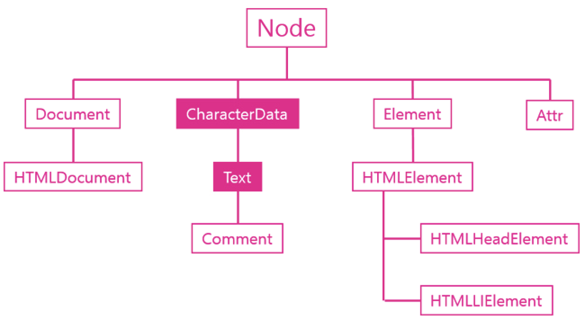

* Text 객체
  
  * 텍스트 객체는 텍스트 노드에 대한 DOM 객체로 CharcterData를 상속 받는다.
  ```
  <p>생활코딩</p> 여기서 <p></p>는 Element 객체, 생활코딩은 Text 객체
  ```

  * 주목할 것은 DOM에서는 공백이나 줄바꿈도 텍스트 노드라는 점이다.

  * 주요기능
    * 값 : 텍스트 노드의 값을 가져오는 API
      * data
      * nodeValue
    * 조작
      * appendData()
      * deleteData()
      * insertData()
      * replaceData()
      * subStringData()
    * 생성
      * docuemnt.createTextNode()

  * 값 API
    * 텍스트 노드는 DOM에서 실질적인 데이터가 저장되는 객체이다. 따라서 텍스트 노드에는 값과 관련된 여러 기능들이 있는데 이번 시간에는 값을 가져오는 두개의 API를 알아본다.
    ```javascript
    <ul>
    <li id="target">html</li> 
    <li>css</li>
    <li>JavaScript</li>
    </ul>
    <script>
    var t = document.getElementById('target').firstChild;   // html 가진 Text 객체
    console.log(t.nodeValue);
    console.log(t.data);
    </script>
    ```

  * 조작 API
    * 텍스트 노드가 상속 받은 CharacterData 객체는 문자를 제어할 수 있는 다양한 API를 제공한다. 아래는 조작과 관련된 API들의 목록이다.
      * appendData()
      * deleteData()
      * insertData()
      * replaceData()
      * substringData()
