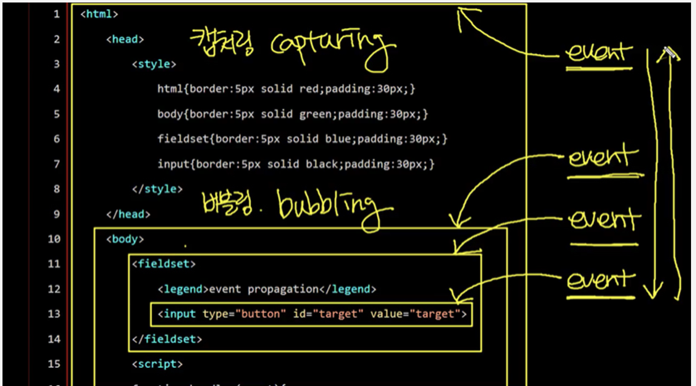

* 이벤트란?
  * 이벤트(event)는 어떤 사건을 의미한다. 브라우저에서의 사건이란 사용자가 클릭을 했을 '때', 스크롤을 했을 '때', 필드의 내용을 바꾸었을 '때'와 같은 것을 의미한다.
  ```html
    <!DOCTYPE html>
    <html>
    <body>
        <input type="button" onclick="alert(window.location)" value="alert(window.href)" />
        <input type="button" onclick="window.open('bom.html')" value="window.open('bom.html')" />
    </body>
    </html>
  ```
  * onclick 속성의 자바스크립트 코드(alert(window.location))는 사용자가 이 버튼을 클릭 했을 '때' 실행된다. 즉 js 개발자는 어떤 일이 발생했을 때 실행 되어야 하는 코드를 등록하고, 브라우저는 그 일이 발생했을 때 등록된 코드를 실행하게 된다. 이러한 방식을 이벤트 프로그래밍이라고 한다.

* event target
  * target은 이벤트가 일어날 객체를 의미한다. 아래 코드에서 타겟은 버튼 태그에 대한 객체가 된다.
  ```html
    <input type="button" onclick="alert(window.location)" value="alert(window.href)" />
  ```

* event type
  * 이벤트의 종류를 의미한다. 위의 예제에서는 click이 이벤트 타입이다. 그 외에도 scroll은 사용자가 스크롤을 움직였다는 이벤트이고, mousemove는 마우스가 움직였을 때 발생하는 이벤트이다.
  * 이벤트의 종류는 이미 약속되어 있다. 아래 링크는 브라우저에서 지원하는 이벤트의 종류를 보여준다. (onclick, onchange ..)
  https://developer.mozilla.org/en-US/docs/Web/Reference/Events

* event handler
  * 이벤트가 발생했을 때 동작하는 코드를 의미한다. 위의 예제에서는 alert(window.location)이 여기에 해당한다.

---

* 이벤트 등록
  * 이벤트 프로그래밍을 하기 위해서는 이벤트의 대상에 이벤트 핸들러를 등록해줘야 한다. 웹브라우저에서는 크게 3가지 종류의 등록방법을 제공하는데 하위 토픽에서 자세한 내용을 알아보겠다.

  * 인라인 방식
    * 인라인 방식은 이벤트를 이벤트 대상의 태그 속성으로 지정하는 것이다. 다음은 버튼을 클릭했을 때 Hello world를 경고창으로 출력한다.
    ```html
    <input type="button" onclick="alert('Hello world');" value="button" />
    ```
    * 이벤트가 발생한 대상을 필요로하는 경우 this를 통해서 참조할 수 있다.
    ```html
    <!--자기 자신을 참조하는 불편한 방법-->
    <input type="button" id="target" onclick="alert('Hello world, '+document.getElementById('target').value);" value="button" />
    <!--this를 통해서 간편하게 참조할 수 있다-->
    <input type="button" onclick="alert('Hello world, '+this.value);" value="button" />
    ```
    * 인라인 방식은 태그에 이벤트가 포함되기 때문에 이벤트의 소재를 파악하는 것이 편리하다. 하지만 정보인 HTML과 제어인 JavaScript가 혼재된 형태이기 때문에 바람직한 방법이라고 할수는 없다.

  * 프로퍼티 리스너
    * 프로퍼티 리스너 방식은 이벤트 대상에 해당하는 객체의 프로퍼티로 이벤트를 등록하는 방식이다. 인라인 방식에 비해서 HTML과 JavaScript를 분리할 수 있다는 점에서 선호되는 방식이지만 뒤에서 배울 addEventListener 방식을 추천한다. 
    ```html
    <input type="button" id="target" value="button" />
    <script>
    var t = document.getElementById('target');
    t.onclick = function(){
    alert('Hello world');
    }
    </script>
    ```

  * 이벤트 객체
    * 이벤트가 실행된 맥락의 정보가 필요할 때는 이벤트 객체를 사용한다. 이벤트 객체는 이벤트가 실행될 때 이벤트 핸들러의 인자로 전달된다.
    ```html
    <body>
    <input type="button" id="target" value="button" />
    <script>
        var t = document.getElementById('target');
        t.onclick = function(event){
        alert('Hello world, '+event.target.value)
    }
    </script>
    ```
    * ie8 이하 버전에서는 이벤트 객체를 핸들러의 인자가 아니라 전역객체의 event 프로퍼티로 제공한다. 또한 target 프로퍼티도 지원하지 않는다. 아래는 이 문제를 해소하기 위한 코드다.
    ```html
    <body>
    <input type="button" id="target" value="button" />
    <script>
        var t = document.getElementById('target');
        t.onclick = function(event){
            var event = event || window.event;      // || 는 event가 있다면 event 사용, 없다면 window.event 사용
            var target = event.target || event.srcElement;
            alert('Hello world, '+target.value)
        }
    </script>
    ```

  * addEventListener()
    * addEventListener은 이벤트를 등록하는 가장 권장되는 방식이다. 이 방식을 이용하면 여러개의 이벤트 핸들러를 등록할 수 있다.
    ```html
    <input type="button" id="target" value="button" />
    <script>
        var t = document.getElementById('target');
        t.addEventListener('click', function(event){
            alert('Hello world, '+event.target.value);
        });
    </script>
    ```
    * 이 방식의 중요한 장점은 하나의 이벤트 대상에 복수의 동일 이벤트 타입 리스너를 등록할 수 있다는 점이다. 
    ```html
    <input type="button" id="target" value="button" />
    <script>
        var t = document.getElementById('target');
        t.addEventListener('click', function(event){
            alert(1);
        });
        t.addEventListener('click', function(event){
            alert(2);
        });
    </script>
    ```
    * 이벤트 객체를 이용하면 복수의 엘리먼트에 하나의 리스너를 등록해서 재사용할 수 있다. 
    ```html
    <input type="button" id="target1" value="button1" />
    <input type="button" id="target2" value="button2" />
    <script>
        var t1 = document.getElementById('target1');
        var t2 = document.getElementById('target2');
        function btn_listener(event){
            switch(event.target.id){
                case 'target1':
                    alert(1);
                    break;
                case 'target2':
                    alert(2);
                    break;
            }
        }
        t1.addEventListener('click', btn_listener);
        t2.addEventListener('click', btn_listener);
    </script>
    ```

---

* 이벤트 전파
  * 캡처링과 버블링
  
    * 캡처링(capturing) : 부모로 부터 자식 event까지 흐름
    * 버블링(bubbling) : 자식으로 부터 부모 event까지 흐름 (많이 쓰임)

* 이벤트 기본동작 취소
  * 웹브라우저의 구성요소들은 각각 기본적인 동작 방법을 가지고 있다.
    * 텍스트 필드에 포커스를 준 상태에서 키보드를 입력하면 텍스트가 입력된다.
    * 폼에서 submit 버튼을 누르면 데이터가 전송된다.
    * a 태그를 클릭하면 href 속성의 URL로 이동한다.
  * 이러한 기본적인 동작들을 기본 이벤트라고 하는데 사용자가 만든 이벤트를 이용해서 이러한 기본 동작을 취소할 수 있다.

  * inline
    * 이벤트의 리턴값이 false이면 기본 동작이 취소된다.
    ```html
    <p>
    <label>prevent event on</label><input id="prevent" type="checkbox" name="eventprevent" value="on" />
    </p>
    <p>
    <a href="http://opentutorials.org" onclick="if(document.getElementById('prevent').checked) return false;">opentutorials</a>
    </p>
    <p>
    <form action="http://opentutorials.org" onsubmit="if(document.getElementById('prevent').checked) return false;">
    <input type="submit" />
    </form>
    </p>
    ```
  * property 방식
    * 리턴 값이 false이면 기본동작이 취소된다.
    ```html
    <p>
    <label>prevent event on</label><input id="prevent" type="checkbox" name="eventprevent" value="on" />
    </p>
    <p>
    <a href="http://opentutorials.org">opentutorials</a>
    </p>
    <p>
    <form action="http://opentutorials.org">
    <input type="submit" />
    </form>
    </p>
    <script>
    document.querySelector('a').onclick = function(event){
    if(document.getElementById('prevent').checked)
        return false;
    };
    
    document.querySelector('form').onclick = function(event){
    if(document.getElementById('prevent').checked)
        return false;
    };
    </script>
    ```
  * addEventListener 방식
    * 이 방식에서는 이벤트 객체의 preventDefault 메소드를 실행하면 기본 동작이 취소된다.
    ```html
    <p>
    <label>prevent event on</label><input id="prevent" type="checkbox" name="eventprevent" value="on" />
    </p>
    <p>
    <a href="http://opentutorials.org">opentutorials</a>
    </p>
    <p>
    <form action="http://opentutorials.org">
    <input type="submit" />
    </form>
    </p>
    <script>
    document.querySelector('a').addEventListener('click', function(event){
    if(document.getElementById('prevent').checked)
        event.preventDefault();
    });
    
    document.querySelector('form').addEventListener('submit', function(event){
    if(document.getElementById('prevent').checked)
        event.preventDefault();
    });
    </script>
    ```    

---

* 폼 이벤트
  * submit
    * submit은 폼의 정보를 서버로 전송하는 명령인 submit시에 일어난다.
    * form 태그에 적용된다.
    * 아래 예제는 전송 전에 텍스트 필드에 값이 입력 되었는지를 확인한다. 만약 값이 입력되지 않았다면 전송을 중단한다.
    ```html
    <form id="target" action="result.html">
    <label for="name">name</label> <input id="name" type="name" />
    <input type="submit" />
    </form>
    <script>
    var t = document.getElementById('target');
    t.addEventListener('submit', function(event){
        if(document.getElementById('name').value.length === 0){
            alert('Name 필드의 값이 누락 되었습니다');
            event.preventDefault();
        }
    });
    </script>
    ```
  * change
    * change는 폼 컨트롤의 값이 변경 되었을 때 발생하는 이벤트다.
    * input(text,radio,checkbox), textarea, select 태그에 적용된다.
    ```html
    <p id="result"></p>
    <input id="target" type="name" />
    <script>
    var t = document.getElementById('target');
    t.addEventListener('change', function(event){
        document.getElementById('result').innerHTML=event.target.value;
    });
    </script>
    ```
  * blur, focus
    * focus는 엘리먼트에 포커스가 생겼을 때, blur은 포커스가 사라졌을 때 발생하는 이벤트다. 
    * 다음 태그를 제외한 모든 태그에서 발생한다. 
    ```html
    <base>, <bdo>, <br>, <head>, <html>, <iframe>, <meta>, <param>, <script>, <style>, <title>

    //
    <input id="target" type="name" />
    <script>
    var t = document.getElementById('target');
    t.addEventListener('blur', function(event){
        alert('blur'); 
    });
    t.addEventListener('focus', function(event){
        alert('focus'); 
    });
    </script>
    ```

---

* 문서로드 이벤트
  * 웹페이지를 프로그래밍적으로 제어하기 위해서는 웹페이지의 모든 요소에 대한 처리가 끝나야 한다. 이것을 알려주는 이벤트가 load, DOMContentLoaded이다.
  ```html
    <head>
    <script>
        window.addEventListener('load', function(){
            var t = document.getElementById('target');
            console.log(t);
        })
    </script>
    </head>
    <body>
        <p id="target">Hello</p>
    </body>
  ```
  * 그런데 load 이벤트는 문서내의 모든 리소스(이미지, 스크립트)의 다운로드가 끝난 후에 실행된다. 이것을 에플리케이션의 구동이 너무 지연되는 부작용을 초래할 수 있다.
  * DOMContentLoaded는 문서에서 스크립트 작업을 할 수 있을 때 실행되기 때문에 이미지 다운로드를 기다릴 필요가 없다. (html 태그들만 로드되면)
  * DOMContentLoaded 이벤트는 IE9을 포함한 모든 브라우저에서 지원하고 있다.

* 마우스 이벤트
  * 웹브라우저는 마우스와 관련해서 다양한 이벤트 타입을 지원한다.

---

* jQuery 이벤트
  * jQuery는 이벤트와 관련해서 편리한 기능을 제공한다.
  * 아래 예제는 직접 이벤트 프로그래밍을 하는 것과 jQuery를 이용하는 것의 차이점을 보여준다.
  ```html
    <input type="button" id="pure" value="pure" />
    <input type="button" id="jquery" value="jQuery" />
    <script src="//code.jquery.com/jquery-1.11.0.min.js"></script>
    <script>
    // 순수하게 구현했을 때
    var target = document.getElementById('pure');
    if(target.addEventListener){
        target.addEventListener('click', function(event){
            alert('pure');
        });
    } else {
        target.attachEvent('onclick', function(event){
            alert('pure');
        });
    }
    // jQuery를 사용했을 때
    $('#jquery').on('click', function(event){   // on 메서드 상 크로스 브라우징 처리됨
        alert('jQuery');
    })
    </script>
  ```
  * 코드 분량에 큰차이가 있다. jQuery는 크로스 브라우징을 알아서 처리해주고, 이벤트를 보다 적은 코드로 구현할 수 있도록 해준다. 이런 이유 때문에 jQuery와 같은 라이브러리를 사용하는 것이다. 

* jQuery의 on API 사용법
  * on은 jQuery에서 가장 중요한 이벤트 API이다. on API를 통해서 jQuery에서 이벤트를 다루는 방법을 알아보자. on의 기본적인 문법은 아래와 같다.
  ```html
    .on( events [, selector ] [, data ], handler(eventObject) )
  ```

  * event : 등록하고자 하는 이벤트 타입을 지정한다. (예: "click")

  * selector : 이벤트가 설치된 엘리먼트의 하위 엘리먼트를 이벤트 대상으로 필터링함
    ```html
    <ul>
    <li><a href="#">HTML</a></li>
    <li><a href="#">CSS</a></li>
    <li><a href="#">JavaScript</a></li>
    </ul>
    <script src="//code.jquery.com/jquery-1.11.0.min.js"></script>
    <script>
    $('ul').on('click', 'a, li', function(event){
        console.log(this.tagName);
    })
    </script>
    ```
    * 위의 예제는 ul 엘리먼트의 하위 엘리먼트 중에 a, li 엘리먼트들에 대해서만 이벤트가 발생한다. 주의 할 것은 ul 엘리먼트는 이벤트가 발생하지 않는다는 점이다. 이것은 jQuery에서 이벤트 버블링을 구현하는 방법이기도 하다.

    * late binding : jQuery는 존재하지 않는 엘리먼트에도 이벤트를 등록할 수 있는 놀라운 기능을 제공한다. 아래 코드를 보자. 
        ```html
        <script src="//code.jquery.com/jquery-1.11.0.min.js"></script>
        <script>
        $('ul').on('click','a, li', function(event){
            console.log(this.tagName);
        })
        </script>
        <ul>
        <li><a href="#">HTML</a></li>
        <li><a href="#">CSS</a></li>
        <li><a href="#">JavaScript</a></li>
        </ul>

        ```
    * 위의 코드는 실행되지 않는다. ul 엘리먼트가 존재하지 않을 때 이벤트 설치를 시도하고 있기 때문이다. 존재하지 않는 엘리먼트에 이벤트를 달 수 없다는 것은 이미 배운 바가 있다. 그런데 jQuery는 존재하지 않는 엘리먼트에게도 이벤트를 설치할 수 있다.
        ```html
        <script src="//code.jquery.com/jquery-1.11.0.min.js"></script>
        <script>
        $('body').on('click','a, li', function(event){  // 존재하는 body 태그 기준으로 등록하면 a, li 태그 생성되면 이벤트 설치됨
        console.log(this.tagName);
        })
        </script>
        <ul>
        <li><a href="#">HTML</a></li>
        <li><a href="#">CSS</a></li>
        <li><a href="#">JavaScript</a></li>
        </ul>
        ```

  * data : 이벤트가 실행될 때 핸들러로 전달될 데이터를 설정함
  * handler : 이벤트 핸들러 함수

  * 다중 바인딩
    * 하나의 엘리먼트에 여러개의 이벤트 타입을 동시에 등록하는 방법을 알아보자.
    ```html
    <input type="text" id="target" />
    <p id="status"></p>
    <script src="//code.jquery.com/jquery-1.11.0.min.js"></script>
    <script>
        $('#target').on('focus blur', function(e){
            $('#status').html(e.type);
        })
    </script>

    <input type="text" id="target" />
    <p id="status"></p>
    <script src="//code.jquery.com/jquery-1.11.0.min.js"></script>
    <script>
        var handler = function(e) {
            $('#status').html(e.type);
        }
        $('#target').on({
            'focus' : handler, 
            'blur' : handler
        })

        $('#target').on('focus', handler).on('blur', handler);
    </script>
    ```
  * 이벤트 제거
    * 이벤트를 제거할 때는 off를 사용한다. 
    ```html
    <input type="text" id="target"></textarea>
    <input id="remove" type="button" value="remove" />
    <p id="status"></p>
    <script src="//code.jquery.com/jquery-1.11.0.min.js"></script>
    <script>
        var handler = function(e){
            $('#status').text(e.type+Math.random());
        };
        
        $('#target').on('focus blur', handler)
        $('#remove').on('click' , function(e){
            $('#target').off('focus blur', handler);
            console.log(32);
        })
    </script>
    ```